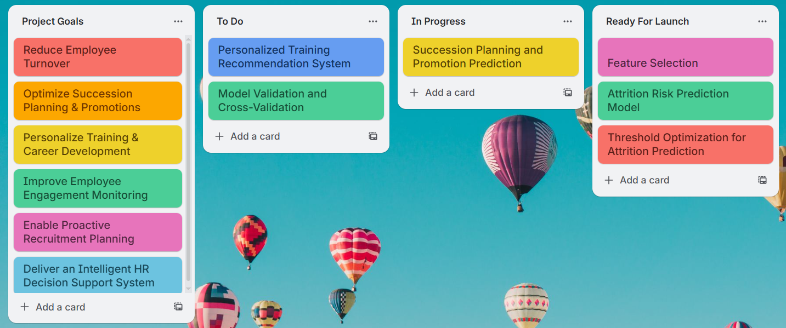

# Intelligent Human Resources Management System  
**with HR Data Analysis & Turnover Prediction**

An advanced **HR analytics and decision support system** that combines **machine learning, data engineering, and business intelligence** to enhance workforce management. The platform predicts **employee attrition**, identifies **promotion potential**, and provides **personalized training recommendations**, supported by **interactive Power BI dashboards**.

This system helps organizations **reduce turnover**, **optimize talent development**, and **improve strategic HR decision-making**.


## 🚀 Project Objectives

- Reduce employee turnover using predictive analytics  
- Optimize succession planning & promotions  
- Personalize training & career development  
- Improve employee engagement monitoring  
- Enable proactive recruitment planning  
- Deliver an intelligent HR decision support system  


## 📌 Project Sprints Overview

The project was developed following an **iterative sprint-based methodology**.

### 🔹 Sprint 1 – Data Preparation & Feature Engineering


### 🔹 Sprint 2 – Predictive Modeling & Machine Learning


### 🔹 Sprint 3 – Business Intelligence & Dashboarding


---
## 📁 Denormalized Dataset: 
[Download Dataset from kaggle] (https://www.kaggle.com/datasets/sivm205/hr-data/data)


## 📊 Power BI Dashboard

Interactive **Power BI dashboards** provide:

- Attrition risk analysis  
- KPI monitoring  
- Promotion insights  
- Training recommendations  

### ▶ Download Power BI File
```md
[Download Dashboard](HR dashboard.pbix)
